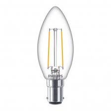
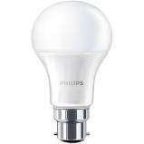
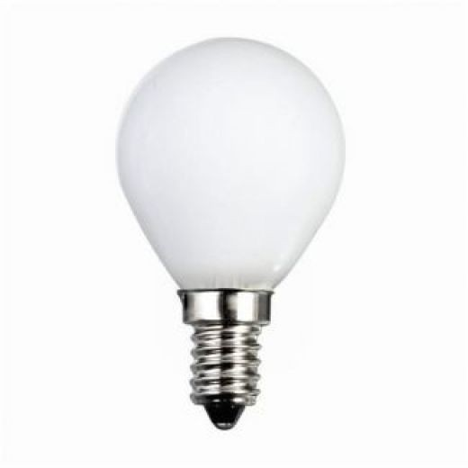
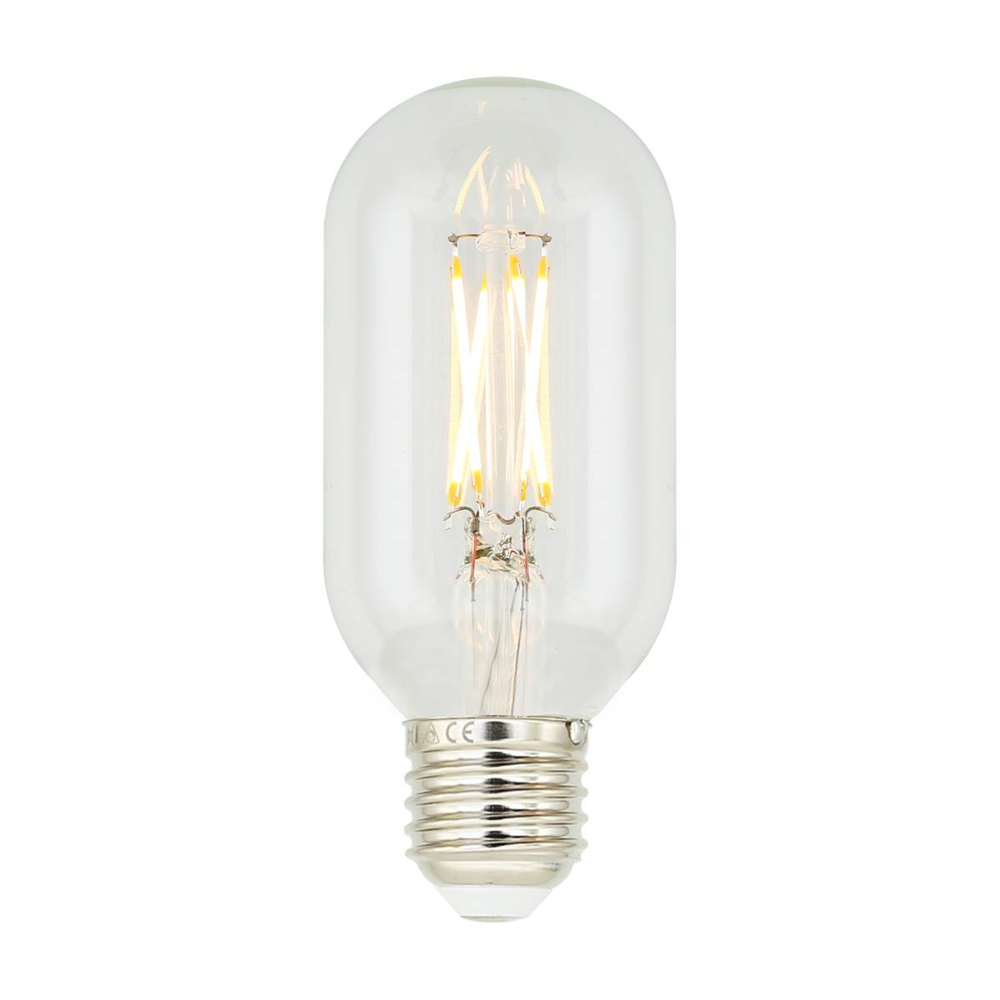
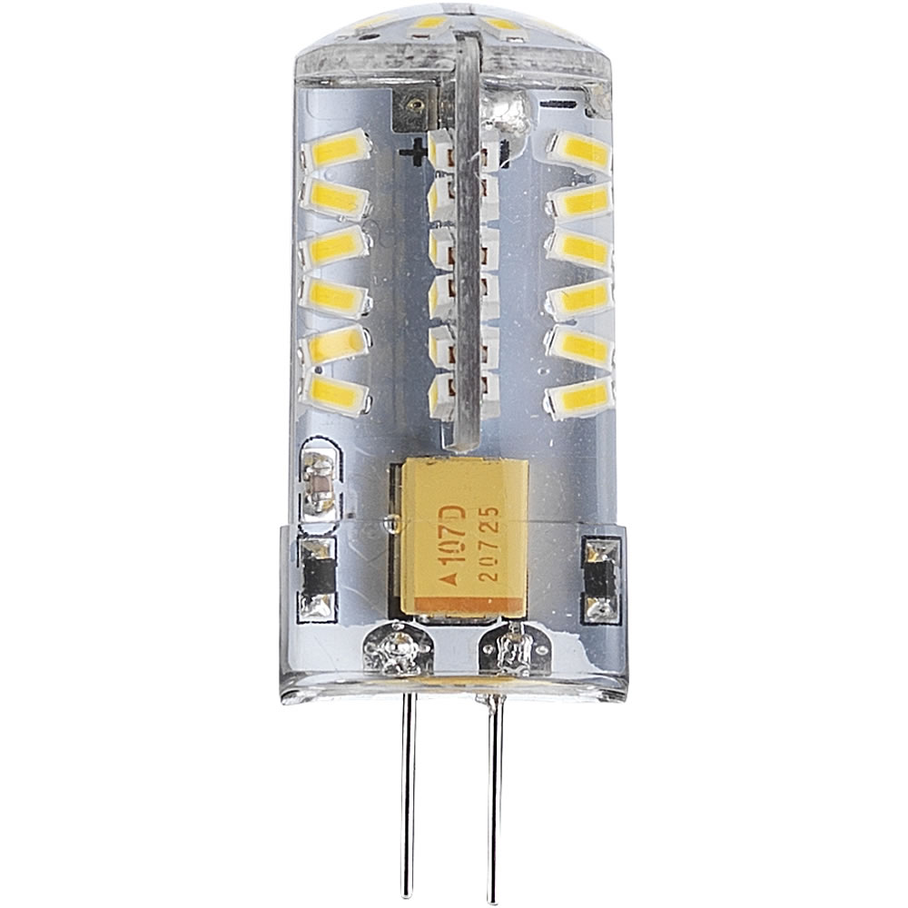
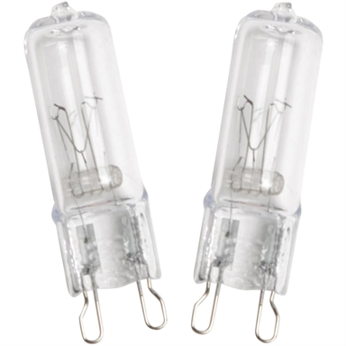

# Bulb Classifier

When changing  a light bulb there are a few different connection types. This can be confusing for the consumer and frustrating to have to go and fiqure it out on the web. 

If you could just take a picture of the connection and be told which connection it is, this would be highly preferable. 

This project attempts to build a classifier to identify the different bulb types.

 The different classes (bulb types) included in the project are ['B15','B22','E14', 'E27', 'G4', 'G9','GU10', 'MR16']
 
 
## Example Images  

[//]: # (Image References)

[image1]: ./example_data/B15/B15518.jpg "B15"
[image2]: ./example_data/B22/B22489.jpg "B22"
[image3]: ./example_data/E14/E140.jpg "E14"
[image4]: ./example_data/E27/E270.jpg "E27"
[image5]: ./example_data/G4/G40.jpg "G4"
[image6]: ./example_data/G9/G90.jpg "G9"
[image7]: ./example_data/GU10/GU100.jpg "GU10"
[image8]: ./example_data/MR16/MR160.jpg "MR16"

I scraped the image data from google image search. Here's an example of each of the image type and the number of images available in the total dataset. 

## B15 (519 images)

## B22 (490 images)

## E14 (562 images)

## E27 (568 images)

## G4 (665 images)

## G9 (592 images)

## GU10 (479 images)

## MR16 (614 images)

### Challenges

This is quite a tricky problem to try and solve. Here are some of the main issues. 

1. Bulb similarity. A lot of the bulbs connectors look similar - they're not dramatically different. They're mostly silver metal prongs of slightly different shape. 

2. The part of the bulb that matters is only the connector. The rest of the image is irrelevant. The main bulb shape can look very similar between two different types. 

3. The training dataset isn't that big and contains errors. 

4. If this was to be an implementation where people take a picture on their phone of their lightbulb the domain of the picture is likely to be quite different to these provided by google which tend to be from images used to sell the bulb and have white backgrounds.

5. Unusual content means there are no pretrained networks on a similar domain. To use transfer learning more later layers will need retraining which makes the training process much slower. 

### Method

I initially tried a CNN trained from scratch. I was struggling to get any decent performance. CNNs from scratch take a lot of training. There was no apparent improvement with increased amount of training. With such poor performance (high bias) I was looking to use a bigger network, train for longer or change the learning rate. 

### Transfer Learning 
Using a pretrained network should help speed up training rather than training from scratch. Depending on how close the domain of the pretraining and the problem are would effect how many layers of the network to leave as trainable. Allowing all layers to be trainable would mean just using the pretrained weights as initization weights which might still be useful. 

The classifier currently isn't very good at predicting the lightbulb type. The challenges above are proving difficult to overcome. I'd like to look at collating my own dataset of images as I think the current dataset is quite poor quality. 

I think to solve this problem it might be required to crop the image to just the connector. An option here would be to use a object detection approach and train the object detector to detect the connector and then which connector it is. This would require training a object detection architecture and the need to have images labelled up with bounding boxes for the connector and the type. 

